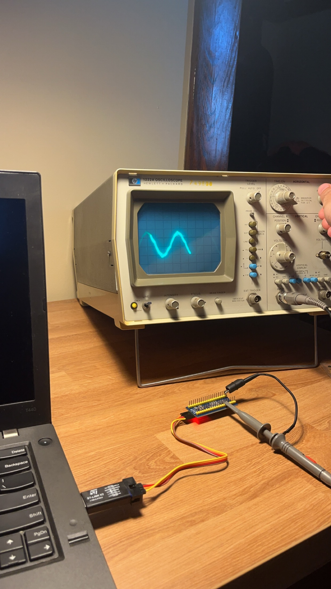
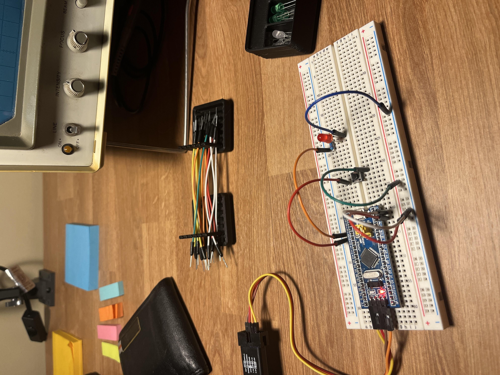

# Welcome
Welcome to my STM32 Baremetal driver repository. These lessons serve as a reference and summary of my work in baremetal driver development, providing clear, concise examples and explanations to support your understanding and growth in STM32 programming.

## Table of Contents

1. [Lesson 1: Understanding MCU Clock Tree](#lesson-1-understanding-mcu-clock-tree)
2. [Lesson 2: HSI Clock Measurement](#lesson-2-hsi-clock-measurement)
3. [Lesson 3: Understanding MCU Interrupt Concepts](#lesson-3-understanding-mcu-interrupt-concepts)
4. [Lesson 3.5: Memory and Peripheral Registers Macros & Definitions](#lesson-35-memory-and-peripheral-registers-macros--definitions)

---

## Lesson 1: Understanding MCU Clock Tree

### Description:
This lesson provides an introduction to the STM32 peripheral clock system. It demonstrates the importance of enabling each peripheral's clock before usage, ensuring proper functionality and power management within the microcontroller.

### Files:
- `004-PeriClockEnable.cpp`

## Lesson 2: HSI Clock Measurement

### Description:
This lesson delves into the different clock sources available in STM32 microcontrollers, focusing on the High-Speed Internal (HSI) clock. You’ll learn how to configure and output the HSI clock signal through a GPIO pin for measurement using an oscilloscope. This practical approach helps visualize the clock signal and understand the microcontroller's timing mechanisms.

    
    <h4> HSI Clock Measurement on the analog oscilloscope </h4>

### Files:
- `004-PeriClockEnable.cpp`
- `005-HSI-Measurement.cpp`

## Lesson 3: Understanding MCU Interrupt Concepts

### Description:
This lesson explores the fundamentals of interrupts in STM32 microcontrollers, which are essential for creating responsive and efficient systems. The lesson walks through configuring a button to trigger an interrupt that activates an LED on a different GPIO pin. This example illustrates how interrupts can be used to handle external events and control GPIO outputs in real-time, emphasizing the practical application of interrupts.

    
    <h4> Bread board design for an interrupt triggered by the button </h4>

### Files:
- `006-MCU-Interrupt-Design.cpp`

## Lesson 3.5: Memory and Peripheral Registers Macros & Definitions

### Description:
This lesson focuses on creating custom header files to define memory and peripheral registers for STM32 microcontrollers. Instead of relying on external libraries to handle these definitions, this lesson demonstrates how to manually organize and build your own header file for defining memory addresses. This approach enhances understanding of low-level register access and provides flexibility for custom development. Additionally, using namespaces improves code organization and prevents naming conflicts, ensuring a more manageable and modular codebase.

### Files:
- `/Drivers/Inc/STM32F103xx.h`
